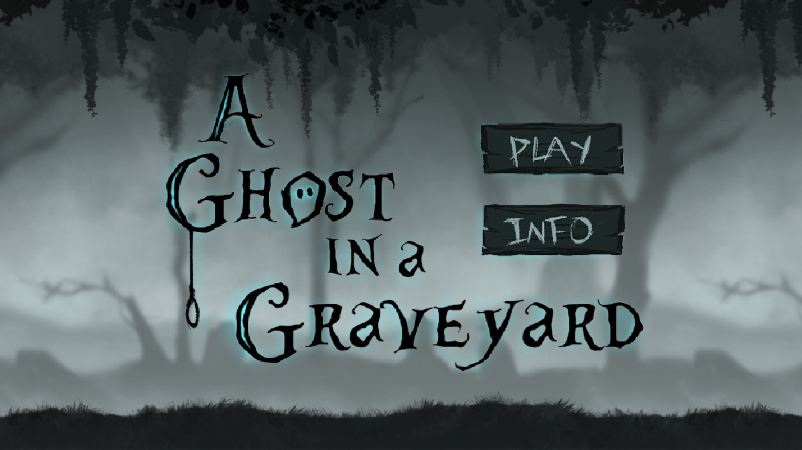
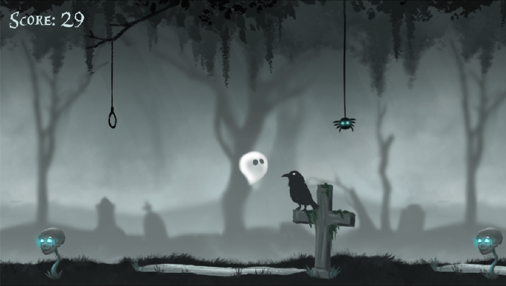

# a-ghost-in-a-graveyard

An atmospheric side-scrolling game created with Lua and LÖVE, in which our Ghost collects skulls and spiders while avoiding tombstones, ponds of water, and nooses. 
The game gets progressively faster, and high scores can be saved under multiple users. All sprites, backgrounds, and animations were designed and illustrated in Photoshop. 

